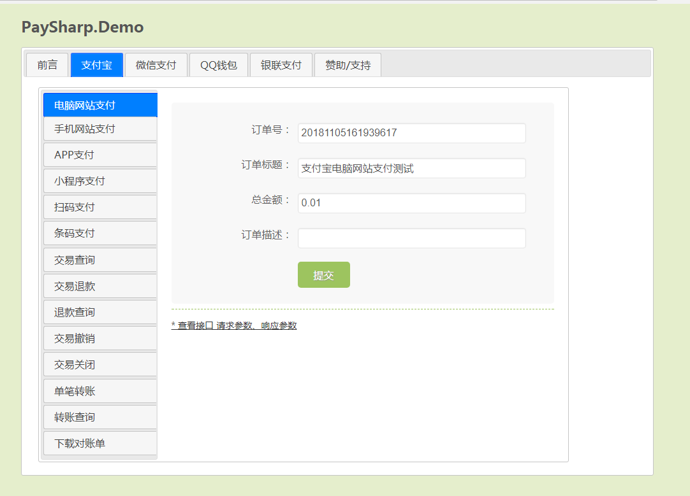

# ASP.NET MVC 在线支付案例

全面整合了 `支付宝` `微信支付` `QQ钱包` `银联支付` 等各大主流支付平台。


## 相关文档
### 1.[支付宝 - 沙箱环境使用说明](https://alipay.open.taobao.com/doc2/detail.htm?treeId=200&articleId=105311&docType=1)
* 1.生成并上传RSA2(SHA256)的应用公钥；配置RSA2(SHA256)的应用公钥后，不需要配置RSA(SHA1)密钥；
* 2.编写代码时，请将
  * a.请求网关修改为：https://openapi.alipaydev.com (此处与官方文档有出入)
  * b.appid切换为沙箱的appid
  * c.签名方式使用RSA2
  * d.应用私钥使用第1步生成的RSA2(SHA256)的私钥(请根据开发语言进行选择原始或pkcs8格式)
  * e.支付宝公钥切换为第1步配置后应用公钥后，点击查看支付宝公钥看到的公钥

### 2.[银联支付 - 沙箱环境使用说明](https://open.chinaums.com/resources/?code=591515751600520&url=beb855f5-903e-4146-83d0-aceb3cf3161b)
* 1、申请全民付账户，第一次登陆开放平台门户会自动分配沙箱开发者账号、开发者密钥； 请在个人中心-开发者账号/密钥管理栏目查看相关的开发者账号信息
* 2、在个人中心-我的应用查看对应的子系统权限，如果需要接入的资源所属子系统不在我的应用列表，请选择对应的子系统提交正确合法的材料申请测试权限， 系统初审通过，会自动分配所申请的子系统下面的所有接口的测试权限。
* 3、编写代码，请将：
  * `调用的URL为：sandbox.open.chinaums.com`；
  * `appId为开发者ID，跟正式环境保持一致`；
  * `appKey为沙箱环境的密钥`；

.NET集成示例
```csharp
  //开放平台生产URL
  String url = "https://api-mop.chinaums.com/";
  //开发者ID
  String appId = "平台分配";
  //开发者秘钥
  String appKey = "平台分配";
  //实例化客户端
  OpenApiclient openApiClient = new DefaultOpenApiClient(url, appId, appKey);
  //根据请求接口拼装参数
  BankVerifyRequest bankVerifyRequest = new BankVerifyRequest();
  bankVerifyRequest.setData("{"cardNo":"","phoneNo":""}");
  //请求调用返回
  BankVerifyResponse bankVerifyResponse = openApiClient.execute(bankVerifyRequest);
  //返回处理 示例仅对于当前接口，具体返回格式处理，请以真实接口为准进行处理
  if(bankVerifyResponse!=null) Console.WriteLine(bankVerifyResponse.getData());
```

## 项目展示
